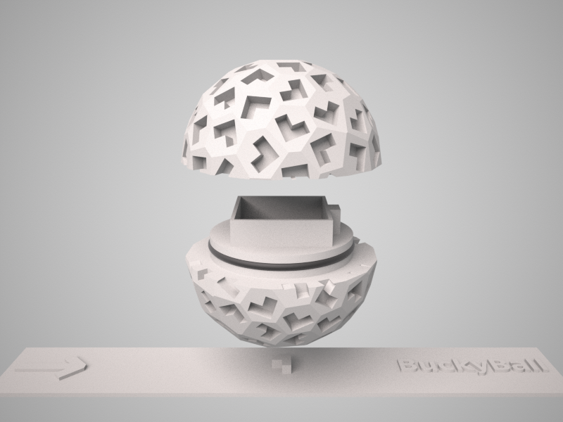

<h1 align="center">BuckyBall</h1>

The BuckyBall holder is a bespoke device for experimental MR imaging that facilitates the repeatable measurement of a sample at a large number of predefined orientations relative to the static magnetic field. The sample holder is manufactured using 3D printing. This software was developed and is maintained by [Enrico Kaden](https://ekaden.github.io) from University College London.

## Citation

If you use this software, please cite:

* Kaden E, Barskaya IY, Kelm ND, Does MD and Alexander DC: BuckyBall: Reproducible gradient-echo MRI measurements with variable magnetic field directions. Proc. Intl. Soc. Mag. Reson. Med., vol. 26, p. 2209, 2018.
<!-- Bibtex entry? -->

## Supplementary material

* [ISMRM 2018 poster](docs/pdf/KadenISMRM2018.pdf)

## License

BuckyBall is released under the [BSD Two-Clause License](LICENSE.md).